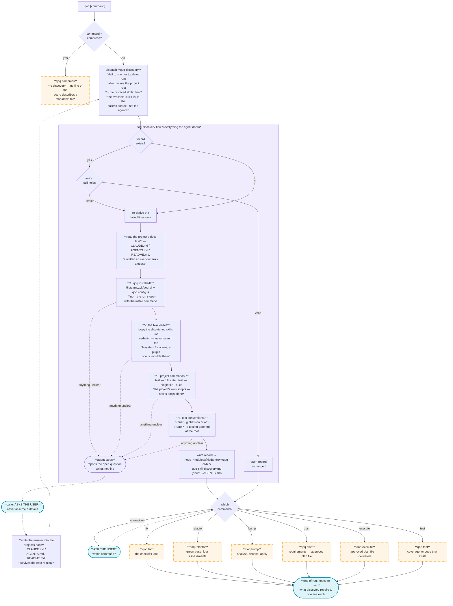
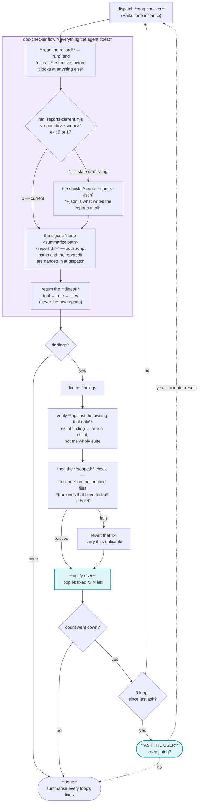
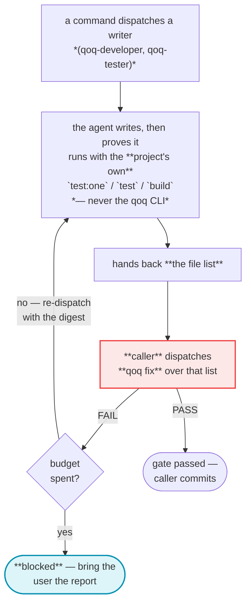
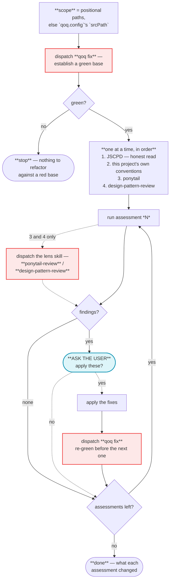
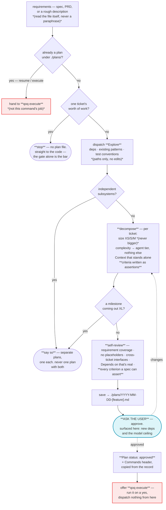
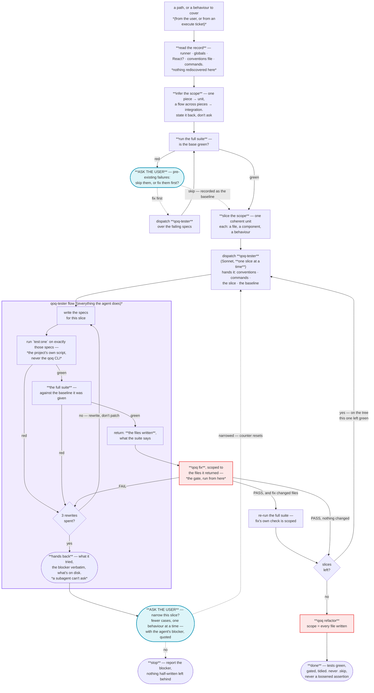
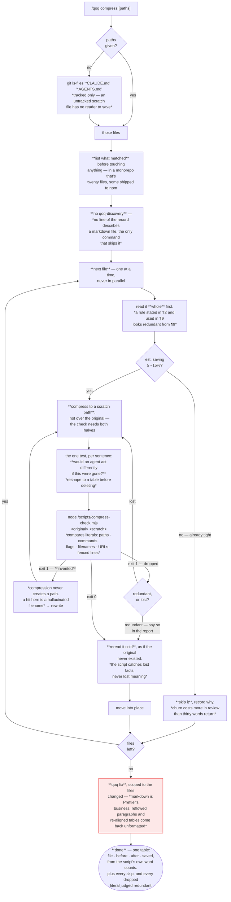

# QoQ workflows — diagrams

**Human reference, not the spec.** Every rule these diagrams show is written out
in prose in `SKILL.md` and the command references, and the prose is what an agent
reads and what wins where the two ever disagree. These are here so a person can
see the shape of a command at a glance without reading it end to end — nothing
routes off them.

**They stay in sync in both directions, in the same change.** Editing a diagram
without editing the prose it maps to below is how this file turns into a
confident lie about a workflow that no longer exists — and prose edited without
the diagram is the same lie pointed the other way. The prose still wins on a
disagreement, so a change that starts here isn't finished until it's argued out
in the reference file too.

| Diagram                                     | Prose it reflects                                                                      |
| ------------------------------------------- | -------------------------------------------------------------------------------------- |
| [Entry and discovery](#entry-and-discovery) | [skill](../skills/qoq/SKILL.md), [discovery.md](../skills/qoq/references/discovery.md) |
| [`fix`](#fix)                               | [fix.md](../skills/qoq/references/fix.md)                                              |
| [`refactor`](#refactor)                     | [refactor.md](../skills/qoq/references/refactor.md)                                    |
| [`bump`](#bump)                             | [bump.md](../skills/qoq/references/bump.md)                                            |
| [`plan`](#plan)                             | [plan.md](../skills/qoq/references/plan.md)                                            |
| [`execute`](#execute)                       | [execute.md](../skills/qoq/references/execute.md)                                      |
| [`test`](#test)                             | [test.md](../skills/qoq/references/test.md)                                            |
| [`compress`](#compress)                     | [compress.md](../skills/qoq/references/compress.md)                                    |

**Legend, shared by all eight.** Purple = a subagent and everything it does.
Amber dashed = a command run directly. Cyan = the user. Red = a qoq command
invoked from inside another.

**One syntax trap worth knowing before you edit a node:** a label must not _start_
with a backtick. `X["` + backtick puts Mermaid into markdown-string mode, and
anything following the closing backtick is a lexer error — the whole diagram then
renders as nothing at all, with no hint as to which node did it. Backticks
anywhere else in a label are fine, so lead with a word: `X["run \`test:one\` on …"]`.

---

## Entry and discovery

---

## `fix`

### Where the scoped gate runs

---

## `refactor`

---

## `bump`

```mermaid
flowchart TD
    CLEAN{"worktree<br/>clean?"}
    CLEAN -->|no| BSTOP(["**stop** — commit or<br/>stash first"])
    CLEAN -->|yes| PLAN["**impact analysis** — what's outdated,<br/>minor/patch grouped,<br/>**one major step per package**<br/>*(nothing written, no patches yet)*"]
    PLAN --> MAJ{"majors, or queued<br/>failures, among them?"}
    MAJ -->|yes| BUMPER["dispatch **qoq-bumper**<br/>(Sonnet, one per package)<br/>*(name, current version)*"]
    MAJ -->|no| BAPPR

    subgraph BUMPFLOW["qoq-bumper flow *(everything the agent does)*"]
        direction TB
        MB0{"a newer major<br/>than current?"}
        MB0 -->|yes| MB1
        MB0 -->|"no — already on the<br/>latest major line"| MBL["target = **latest stable**<br/>within it"]
        MBL --> MB1
        MB1["read the changelog / release notes /<br/>migration docs for **current → target**"]
        MB1 --> MB2["grep **this codebase** for the<br/>APIs that actually changed"]
        MB2 --> MB3["return: breaking changes that<br/>land here, migration steps, risk<br/>— *no edits*"]
    end

    BUMPER --> MB0
    MB3 --> BAPPR(["**ASK THE USER**<br/>here's the impact —<br/>**pick / exclude**, then approve"])

    BAPPR -.->|"nothing picked"| BSTOP
    BAPPR -.->|"the chosen set"| MAKE["**now** write the git patches —<br/>one per bump, selected only"]
    MAKE --> BAPPLY

    BAPPLY["apply next patch<br/>+ reinstall"]
    BAPPLY --> BVAL["**validate** — all three, in order<br/>`qoq fix` · `test` full suite · `build`<br/>*(commands from the record)*"]
    BVAL -->|passes| PREF["**qoq refactor --decisions auto**<br/>scope = this patch's files —<br/>*applies the safe tier,<br/>advises the rest*"]
    PREF -->|"changed nothing"| BMORE{"patches left?"}
    PREF -->|"changed something"| BREVAL["**re-validate** — test + build<br/>*(the refactor's own fix already ran)*"]
    BREVAL -->|passes| BMORE
    BREVAL -->|fails| BSPLIT
    BVAL -->|fails| BSPLIT{"can this patch<br/>split further?"}
    BSPLIT -->|"yes — grouped → **minor** / **patch**,<br/>then → **one per package**"| BRECUT["revert it,<br/>re-cut at the next level down"]
    BRECUT --> BAPPLY
    BSPLIT -->|"no — one package left"| BSEEN{"already been through<br/>**qoq-bumper**?"}
    BSEEN -->|no| BQ["revert it, **queue the package<br/>for qoq-bumper**<br/>*(next round)*"]
    BSEEN -->|yes| BREV["revert it, carry the package<br/>as unbumpable + why"]
    BQ --> BMORE
    BREV --> BMORE
    BMORE -->|yes| BAPPLY
    BMORE -->|no| BEHIND{"a major still behind,<br/>or a queued failure?"}
    BEHIND -->|"yes — re-plan,<br/>re-approve"| PLAN
    BEHIND -->|no| BDONE(["**done** — applied,<br/>reverted, skipped"])

    classDef agent fill:#8b5cf61f,stroke:#8b5cf6,stroke-width:2px
    classDef user fill:#06b6d422,stroke:#0891b2,stroke-width:2px
    classDef skill fill:#ef44441f,stroke:#ef4444,stroke-width:2px

    class BUMPFLOW agent
    class BAPPR user
    class PREF,BVAL skill
```

---

## `plan`

---

## `execute`

```mermaid
flowchart TD
    EARG["plan path — ./plans/[file].md"]
    EARG --> ELOAD["**load the plan, fresh from disk**<br/>every time, resume or not"]
    ELOAD --> EDRAFT{"Plan status<br/>approved?"}
    EDRAFT -->|draft| EBACK["back to **qoq plan** —<br/>it was never signed off"]
    EDRAFT -->|approved| EPROG{"any ticket<br/>in-progress?"}
    EPROG -->|"yes — a dead run"| ERECON["reconcile against git log:<br/>committed → done,<br/>otherwise re-dispatch"]
    EPROG -->|no| EBRANCH
    ERECON --> EBRANCH{"on the default<br/>branch?"}
    EBRANCH -->|yes| EASK(["**ASK THE USER**<br/>branch first? plan/[name]"])
    EASK -.-> EWAVE
    EBRANCH -->|no| EWAVE

    EWAVE["**next ticket** — the first whose<br/>deps are all done, in plan order"]
    EWAVE --> EDISP["dispatch **one qoq-developer** —<br/>model = the ticket's tier,<br/>*(the plan already assigned it)*"]

    subgraph EDEV["qoq-developer flow — TDD *(everything the agent does)*"]
        direction TB
        T0["**read the record** — runner · globals ·<br/>React? · conventions file · commands ·<br/>how to invoke qoq. *first move*"]
        T0 --> T1["**red** — write plain assertions<br/>straight from the acceptance criteria,<br/>**in the project's dialect**"]
        T1 --> T2["**green** — implement the ticket<br/>until those assertions pass"]
        T2 --> TRAISE["**raise them to the bar itself** —<br/>test-conventions.md: mocking,<br/>the edge cases a first pass skips.<br/>*no dispatch — a subagent<br/>can't spawn one*"]
        TRAISE --> T4["**prove it runs** — the project's<br/>own `test:one` + `build`.<br/>*never the qoq CLI: the gate<br/>is the caller's move*"]
        T4 -->|"red"| T5{"3 attempts<br/>spent?"}
        T5 -->|no| T2
        T5 -->|"yes"| THAND(["**handoff report** —<br/>never narrow the ticket,<br/>never weaken the gate"])
        T4 -->|"green"| TRET["hand back: **every file changed**,<br/>what the specs cover, advisories"]
    end

    EDISP --> T0
    TRET --> EGATE["**qoq fix**, scoped to the<br/>files it returned"]
    EGATE -->|FAIL| T5
    EGATE -->|PASS| TCOM["commit exactly<br/>this ticket's files"]
    TCOM --> EDONE["**Status: done**<br/>+ commit hash, advisories"]
    THAND --> EESC{"a tier<br/>above?"}
    EESC -->|"yes — re-dispatch with<br/>the report pasted in"| EDISP
    EESC -->|"no — top rung already"| EBLOCK(["**Status: blocked** — bring the<br/>user the report: bad ticket,<br/>or session model too small"])
    EDONE --> EMORE{"tickets left in<br/>the milestone?"}
    EBLOCK --> EMORE
    EMORE -->|yes| EWAVE
    EMORE -->|no| EMGATE["**refactor** — the third TDD beat, delegated:<br/>**qoq refactor --decisions auto** over every<br/>file the milestone's tickets touched,<br/>then the full test suite + build"]
    EMGATE -->|red| ENEW["write the failure up as a new<br/>ticket — sized, rated, dispatched"]
    ENEW --> EWAVE
    EMGATE -->|green| EARCH["**archive** — milestone text to<br/>.completed.md, summary stays,<br/>downstream Context updated first"]
    EARCH --> EMS{"milestones<br/>left?"}
    EMS -->|yes| EWAVE
    EMS -->|no| EFIN(["**done** — plan delivered"])

    classDef agent fill:#8b5cf61f,stroke:#8b5cf6,stroke-width:2px
    classDef user fill:#06b6d422,stroke:#0891b2,stroke-width:2px
    classDef skill fill:#ef44441f,stroke:#ef4444,stroke-width:2px

    class EDEV agent
    class EASK user
    class EBACK,EMGATE,EGATE skill
```

---

## `test`

---

## `compress`

**No purple on this one.** `compress` dispatches nothing — it is judgement about
meaning applied to one file at a time, and two agents rewriting sibling docs are
how the same fact ends up disagreeing with itself in two places.
